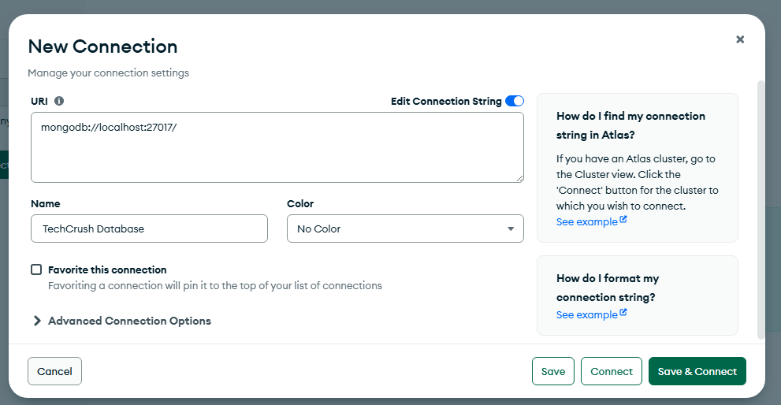
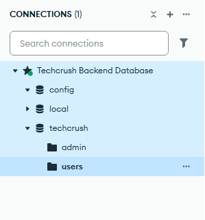

### Database with Express.js

Before you can access SQL Database, you need a language which is SQL. If you know SQL, you can do Postgress, MySQL, RedisDB an other db. So being structured has an advantages.

For learning SQL you can go to <a href="https://www.w3schools.com/sql/default.asp">w3schools.org</a>

We have different SQL: SQL, MySQL and Postgre SQL. They are stull the same SQ,  Bit there are some extra features which makes them differ.

You can learn about NoSQL but not to that extent. Now talking about MongoDB. Note for capstone don't do something complex like email services which will require payment of api except if your projects demands.

### MongoDB
MongoDB is a NoSQL database that stores data in a flexible JSON-like format for flexiblity and horizontal scalability

On MongoDB Compass tool it works on a port so we set it to localhost. Also ensure MongoDB service msi package


Your database also runs on a port

- Key features include:
1. Document Orientated storage when data is store in documnets within collection.
2. Dynamic schemas where collections can store documents within varying structures
3. High performance, optimized for high-speed data retrieval and storage

We are going to use the mongoose paackage

`npm install mongoose`

`mongoose` act as the intermediary between nodejs and the database. For capstone do not use firebase. The main thing is the product so that can it can deliver what it is meant to do.

With the knowledge of backend we can venture into DevOps

So mongoose is looks like a middleware but it is not like a middleware.

Mongoose is an Objecct Data Modeling (ODM)  library for MongoDB and Node.js. It manages the relationship between data, provides schema validation and is used to translate between objects in code and full representation of those object in MongoDB

MongoDB port is `27017` as in `localhost:27017`.


Here Techcrush Backend Database is the connection running at localhost:27017

We have databases under the collections for admin, local, users and also a tech crush database with disc like icons

Under the `techcrush` database we create a <b>collection</b> of data which are `admin` and `users`

The collection takes in documents. So we can have a record coming with email and another record ot coming with emil in the same connection, MongoDB will not give error but MySQL will give an error.

Database --> Collection --> Documents

MySQL, you have to run script edit a columns

Example

```
ALTER TABLE users
ADD age integer
```

But for mongodb we don't have to do this.

We know that mongodb is flexible, we need a solution that will not mess it up. so this is were mongodb comes to play.
mongoose will not allows to mess up things

We can handle emails with mail trap.

An application of mongodb, in a school, they were asked to submit their data but they did not specify the data to submit. For example a student can submit name, age but didn't submit subject another may even not add his age. 

If there is a scanner that tells the user that they forget to provide a field of data, mongoose is like that scanner. So we have to ensure that the data throws an error before it reaches MongoDB.


### MySQL 
MySQL is a database for data maipu;ation, it stores in table of rows and column. To work with mysql, we need a package called `mysql2`

`npm install mysql2`

Because we are still learning the raw sql we can add a layer of called `sequelize`

`npm install sequelize`

There is also an alternative to sequilize, there is `prisma` that works very well with typescript, `drizzle` etc

Sequel is a promise based Node.js ORM (Object Relational Mapping) for various databases including MySQL, PostgreSQL, SQLite and Microsoft SQL server. 

It provides a straight forward way to interact with relational database by allowing developers to use JavaScript Object instead of writting raw SQL queries.

It allows to pass the sql code into the database

This abstraction simplifies database CRUD operations which invloves creating, reading, updating and deleting of records

Sequelise has its own documentations. We may choose to use the sequelize or not.

For defining schema, we need models like creating new Object using class. We need to create models

### Creating Models

The word model means a table in MySQL or a collection in MongoDB. We are working on a database structure

LIBRARY Model
- Users
- Books
- Categories
- Borrows
- Visitors Log

USERS Model
- id
- firstname
- lastname
- email
- phonenumber
- gender
- registration date
- department
- nationality
- registration number

BOOKS Model
- id
- title
- year_of_publication
- author
- edition
- isbn
- format
- no_of_pages

CATEGORIES Model
- id
- title
- description
- status

BORROWS Model
- date
- duration
- user_id
- due_date
- book_id
- book_condition

VISITORS LOG Model
- id
- user_id
- date_visited
- date_left


