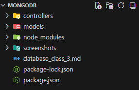
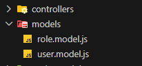
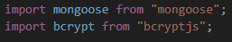
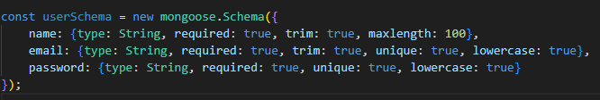
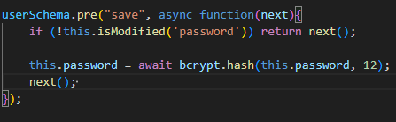
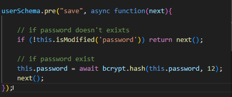
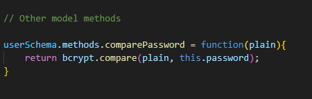
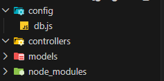
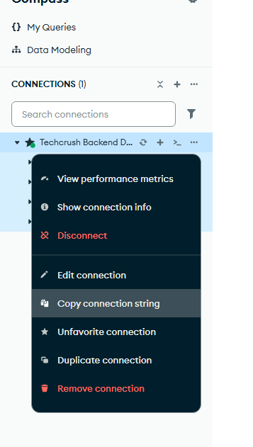
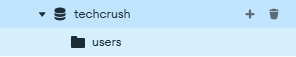

## Database MongoDB and MySQL

We can convert a mongodb to mysql, all we have to do os to remove the functions related to mongodb

So we will be working in separate projects one for mongodb and the other for mysql

### mongodb poject

The first step is to initialise our project

```
npm init -y
```

Remember to indicate the "type": "module" in the package.json file

We also have to install mongoose package

`npm install mongoose`

We also need password encryption, there are two packages we can make use of

- bcrypt
- 

Note there is bcyrpt and bcrypt.js. bcrypt.js is an optmised version of bycrpt. bcryptjs is optimised for javascript. So bcrypt is the binary, so we have bcrpyt for js, bcrypt for php.

bcrypt is very slow. So for your project you can choose to use bcrypt or bcryptjs

### Bycrpt
This is a library for hashing password. So for our mongodb project we are doing `bcryptjs`. We install it along with our mongoose

`npm install mongoose bcryptjs`

We need to create a folder for models and controllers



So we want to do model for users and model for roles. We name our model files anyway we want like `userModel.js` or `user_model.js` or `user.model.js`  



For your user.model ther first thing you need is to import mongoose and bycrpyt



We need to define our user schema

### Schema
A schema in mysql means table. So in mysql schema is already there but mongodb doesn't have a schema

- So we have to define the schema in our codebase so that it will reflect on our mongodb. 
- Schema doesn't exist in codebase of mysql it exist in the database

Defining schemas in mongoose
We need to call the schema method, inside the schema method, we define the thinigs we want inside the column like: username, password, email, verification, reset token, timestamps

So we can specify datatypes like Strings, Numbers, and set it as a required field.



For password we don't need to add trim because some users can may space to their password to keep it secured. Password must not be limited to lowercase

```
password: {type: String, required: true, select: false, minLength: 8}
```

`select: false` ensures that your query doesn't enter as the password


Difference between hashing and encryption. Encryption is reversible but anything that has been hashed cannot be reversed. Encryption is less safer than hashing, if your encryption key is stolen you are nor safe

```
isActive: {type: Boolean, default: true}
```

`default` sets a default value for the users

```
lastLogin: {type: Date}
```

There are somethings called hooks. We can have hooks in our schema. We have prehook and posthook. 

Prehook means like when you are doing something for the first time, or before you find something or save something or perform an acrion before entering the database.
Example is hash users password before saving. So it's like we perform a prehash before entering the database




Here,  we initiate the pre before saving it in record, check if the password has been changed, if it is not changed just continue. If the password has been changed, take the password has been changed and hash it.




What we just did is called a model method

Other model methods



To remove sensitive things from entering the database and we only want json to enter. We create another method

To prevent our json from leaking of sensitive information

```
userSchema.methods.toJSON = function(){
    const obj = this.toObject();
}
```


With `userSchema.methods.toJSON` so we can convert the userSchema methods in JSON.  `this.toObject` converts the instance of the User Schema which is in JSON to an object.

With that we `delete` things like the actual password verification tokens.

```
userSchema.methods.toJSON = function(){
    const obj = this.toObject();
    delete obj.password;
    delete obj.verifyToken;
    delete obj.resetToken;

    return obj;
}

```


Then we are going to need indexing. Index are natural in MySQL and Postgress but not natural in MongoDB. Index helps us to research through out our database effectively. We get user info from index

```
userSchema.index({email: 1});
```

After we are done, we export our User Schema as a model using `mongoose.model('Key', modelSchema)`

```
export const User = mongoose.model('User', userSchema);
```

In mongodb we have to first define our Schema before finally defining it as a model. So from the model we will be calling Users based on the schema

Now for the roleModel.

Also we need to add timeStamp to the UserSchema so that we can hae time the user was created

`const userSchema = new mongoose.Schema({}, {timeStamp: true})`;

`timeStamp` is a built in schema that allows us to use time so it is placed as the second argument


<b><i>role.model.js</i></b>

```
import mongoose from "mongoose";

const roleSchema = new mongoose.Schema({
    name: {
        type: String, 
        required: true, 
        unique: true, 
        lowercase: true, 
        trim: true
    },
    description: {type: String}
    }, {timeStamp: true}
);

export const Role = mongoose.model('Role', roleSchema);
```

Now to connect our roles to user model

<b><i>models/user.model.js</i></b>
```
....

    password: {type: String, required: true, unique: true, select: false, minLength: 8},
    role: {type: mongoose.Schema.Types.ObjectId, ref: "Role"},
    isActive: {type: Boolean, default: true}, 
    isVerified: {type: Boolean, default: true},
    resetToken: {type: Boolean, default: true},
    lastLogin: {type: Date}, 
```

All these stuffs are not neccessary in MySQL.

The `role: {}` in the userSchema references to the id created by role.model.js via  `ref('Role')`

```
role: {type: mongoose.Schema.Types.ObjectId, ref: "Role"},
```

Now we create our controller. 

Every route must feed into controllers, every controller to services. Services should be the making the actual call to your models.

So for now we are just skipping by feed models directly into controller.

The best way is to to put it (i.e models) into services so that our controller will be very light. So all you need to do is to passs yur controllers into services

So what your controller have to do is pass information into services.
Services is where your business logic lives

#### Connecting mongoose to our MongoDB

We will need to add our configuration in our `config` folder as `db.js`



We also use .env in your project so that we can manage your secrets properly

MongoBD connection check the documentation: "Connections"

- import mongoose
- create connection
- add your mongodb url
- we put it in a try-catch so that it will not break

Note the use of `{unique: true}` it allows to make a particular field unique so that we will not have multiple data for a particular fields. It prevents multiple emails. It like saying a user signs in with a email then sign in another time with a different email. So we say that email aready exists.

Getting our MongoDB url



```
const MONGO_URL = "mongodb://localhost:27017/"
```
Creating MongoDB database



To specify the Database that we need from the connection, we use `/techcrush`

```
const MONGO_URL = "mongodb://localhost:27017/techcrush"
```

Remember to add password to your database. If you want to add the password via advanced connnection settings in settings 

<b>config/db.js</b>

```
import mongoose from "mongoose";

const MONGO_URL = "mongodb://localhost:27017/"

const connectToDB = async () => {
    try {
        await mongoose.connect(MONGO_URL);
    } catch (error) {
        console.error(error.message);
        process.exit(1);
    }
}
```
`process.exit(1)` stops the entire application if there is an error in the database connection.

`console.error(error.message);` allows us to get the error message.

We then export it

```
export default connectToDB;
```

<b><i>app.js</i></b>
```
import express from "express";
import connectToDB from "./config/db.js";

const app = express()

// First connect to database
connectToDB()

app.listen(5000, ()=>{
   console.log("Server now running at http://localhost:5000"); 
});
```

Before the app server starts running via `app.listen()`, we need to first connect to our database `connectToDB()`


Please do not do your database action in your controller you need to do it in your service. But for this class we are doing it in the controller. But for the MySQL app we are going to do it normally

<b><i>auth.controller.js</i></b>

If thing we want to do is to import crypto. Crypto is built into node.js.

<b>Crypto</b> is a package that allows us to generate random characters.

```
import crypto from "node:crypto";
```


We then import our Schema

```
import { User } from "../models/user.model.js";
import { Role } from "../models/role.model.js";
```

```
const register = async (req, res) => {
    const {name, email, password} = req.body;
    
    if (await User.findOne({email})) {
        return {sucess: false, message: "Email already exists"};
    }
        // console.log(user({name: "Samuel"}));
    };

```

By using `User.findOne({email})`, it allows to check if a this email already exists in a database. There are other methods apart from  `Model.findOne()`, there is `Model.exists()` to heck if a particular record exists

We need to verify token by creating a token for the user

```
const verifyToken = crypto.randomBytes(32).toString('hex');
```
For this class we later changed the rule in `user.model.js` back to `{type: Number}`. So that we can access the user id with just number

Now to create the record to our database. We need to create payload for our User Schema

```
const user = await User.create({
    userName, email, password, verifyToken, roles: 1
});
```

`roles` just to type a default value incase if role doesnt exit

We then create return response success meassage to show that the record we have created was successful

```
    res.status(200).json({id: user._id, email, message: "User registered sucessfully"});
```

MongoDB makes use of id too like a default or built in id
so we make use of that variable `user._id`. MySQL also have its own id.

Full code

```
import crypto from "node:crypto";
import { User } from "../models/user.model.js";
import { Role } from "../models/role.model.js";

const register = async (req, res) => {
    const {userName, email, password} = req.body;

    // checking if a user exists before registering
    
    if (await User.findOne({email})) {
        return {sucess: false, message: "Email already exists"};
    }
        const verifyToken = crypto.randomBytes(32).toString('hex');

        const user = await User.create({
            userName, email, password, verifyToken, roles: 1
        });

        res.status(200).json({id: user._id, email, message: "User registered sucessfully"})

};

export register;
```


So it turns out there was suppose to be a service that handles creation of user so we did it in controller instead

Back to <b>app.js</b>

We import the register from the `auth.controller.js`

We will define a post route to use the register service that is feed into the controller. But this will be done better in the MySQL own.

`app.use("/register", register)`

<b>app.js</b>

```
import express from "express";
import connectToDB from "./config/db.js";
import {register} from "./controllers/auth.controller.js";

const app = express();

// First connect to database
connectToDB()

app.post("/register", register);

app.listen(5000, ()=>{
   console.log("Server now running at http://localhost:5000"); 
});
```

You can now start your server... and test with the PostMan API

By samuel can also use `node --watch app.js` instead of `nodemon`

#### Errors.
During the course of running the code, error were detected like the use of next(), some properties in the Userschema where meant to be Boolean and not adding express.json middlware at the beginning. Please refer to app.js because all error as been resolved.


