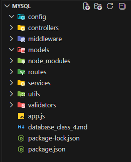
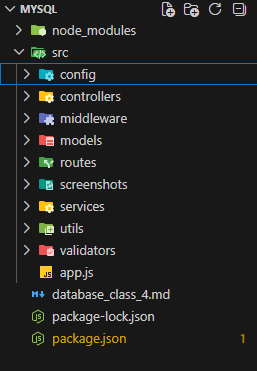

## Database MongoDB and MySQLs


### mysql

The same knowledge we use in mongo db we can use it in mysql.
Note this: if you can find a suitable host for mysql you can switch to postgresql

`sequelize` also works with postgresql.

Focus for this project
- Redis package
- MySQL
- Nodemailer
- Logging Error and Request
- Cors
- Middleware (RBAC)
- API connection
- Validation
- JWT
- .env

We start with our folder structures which includes `config`, `controllers`, `middeware`, `models`, `routes`, `services`, `utils`, `validators`.



Remember to add the `"type":"module"` in our package.json file because we are working with esm.

We are going to install our packages which includes: `bcryptjs`,`cors`, `dotenv`, `express`, `jsonwebtoken`, `mysql2`, `nodemailer`, `sequelize`, `uuid`, `express-validator`, `express-rate-limiter`, `compression`, `morgan`, `helmet`, `axios` (for fetching from other people), `winston`, `winston-daily-rotate-file`


Now what these packages are.

`cors` - Cors means cross origin resource sharing. If there is there is no cors we can share resources to frontend.

`axios` - is a tool or libary that helps us to properly fetch data from other endpoints or other APIs.

`compression` - it helps to compress our request into something like gzip file. It compresses our request and response.To ensure that your requests and your responses are lightweight.

Note if we have `cors` you will be able to recieve responses from selected frontend applications. This means that if a specific frontend must have access to our application. e.g www.frontend.com can access our backend but www.frontend2.com will not have access if you have the correct settings.

If we did not implement `cors` we will be getting cross orgin error. Note: Your frontend will not work if we did not implement `cors`

`dotenv` - There are certain secrets we can't hard code into our application, but with `dotenv` we can isolates different things. We can have multiple .env files to store things related to development, staging requirement database. So what is `.env`: secrets that should not ne hardcoded 

Note: We should not push `.env` and `node_modules` in github.
Beacue if we put .env file to github, we have expose secrets. For developers to communicate the .env file it needs to be through another means not github.


<b><i>How .env works</i> </b>

Every node.js process is a global object, and since it is a global object we can call it anywhere it is available. When .env loads in an application, it takes all the secrets and loads inside a process and call those secrets within the process. So when that process ends, i.e the applications end, those secrets disappear amd they can differ from one application to another

`express-rate-limiter` - it does throttling, it simply means that there is a cap to the amount of request we can get bu after the cap is reached, you will not be sent out of the application but the speed or amount of things you can acheive just reduces. So like saying that we have reached a request of 100 request per minute so our request hae been capped.

`express-validator`- it is used to validate forms

`helmet`- Helmet is largely used for things like logging requests.

`jsonwebtoken` - It is used to generate <b>signed </b>tokens, emphasis on signed token.

`morgan` - It is used for logging

`mysql` is our driver for our database

`nodemailer` is use for sending database

`sequlise` is used as ORM to connect to our database. We can also use sequelise with postgresql

`uuid` is used for generating uuid - Universal Uniform Identifer, which is used for logging

`winston` is used for logging things into a file. If production is down, it generates all the logs in a file so that we can identify error in logs

Note everything in the folder structure must be in the `src` (sourc ecode) folder




### Starting we start with database configuration

<b><i>config/db.js</i></b>

We setup sequelise, if we check the documentation, we can authenticate, log and so many other things like closing connection after application stops running.

```
import {Sequelise} from "sequelize";

export const sequelise = new Sequelise('database', 'username', 'password', {
    host: 'localhost',
    dialet: 'mysql'
});
```
We can specify `dialet: ` to anything like 'mysql', 'postgresql'. We set `dialet: 'mysql';`


### Setting the env for the database
<b><i>config/env.js</i></b>

This will be responsible for bringing stuff from the env file. Once we imported env is now installed in our application

```
import 'dotenv/config';
```

Now we can now access the processes

`process.env`
What this does is that it creates an object of our configurations inside our .env file

```
export const configuration  = {
    API_URL: process.env.API_URL,
    FRONTEND_URL: process.env.FRONTEND_URL,
    CORS_ORIGIN: process.env.CORS_ORIGIN,
    PORT: process.env.PORT,
    DB_HOST: process.env.DB_HOST,
    DB_USER: process.env.DB_USER,
    DB_PASSWORD: process.env.DB_PASSWORD,
    DB_NAME: process.env.DB_NAME,
    DB_DIALET: process.env.DB_DIALET,
    JWT_SECRET: process.env.JWT_SECRET,
    JWT_EXPIRES: process.env.JWT_EXPIRES,
    SALT_MODE: process.env.SALT_MODE
};
```

So we can also set a value such that incase if a particular configuration is missing by using using the logic OR `||`

```
    FRONTEND_URL: process.env.FRONTEND_URL || 'http://localhost:5000', 
    CORS_ORIGIN: process.env.CORS_ORIGIN || 'http://localhost:5000',
    PORT: process.env.PORT || 3000,
```

All what we are doing the `import 'dotenv/config';` is loading it inside process.


### Loading the configurtion inside the .env file
So we are going to create a .env file inside our root folder

<b><i>.env</i></b>

```
NODE_ENV=development
PORT=3000

API_URL=http://localhost:3000;
FRONTEND_URL=http://localhost:5000/
CORS_ORIGIN=http://localhost:5000/ 

DB_HOST=localhost
DB_USER=samuel
DB_PASSWORD=ola
DB_NAME=samuelola
DB_DIALET=mysql
JWT_SECRET=b04867c5736c2dc349ae0a28ed02ac9f291483ad1dc30a968b8a8edf7460fb07
JWT_REFRESH=7d
JWT_REFRESH_SECRET=d37877319e8872525fb0b4c7875d2007547b64886af3c7dbebccfd12f4240bd6
JWT_REFRESH_EXPIRES=30d
SALT_ROUNDS=10
```

For the `JWT_SECRET` you can generate one by going to <a href="https://jwtsecrets.com/">jwtsecrets.com</a>

```
CORS_ORIGIN=http://localhost:5000/, http://local:4000, http://github.com
```

Setting this allows to get another cors url incase if one url doesn't work


```
SMTP_HOST=smtp.example.com
SMTP_PORT=587
SMTP_USER=
SMTP_PASSWORD=
MAIL_FROM=
```

This part of configuration handles node mailer

To use the configurations we just use like an object and each as the property

`configuration.NODE_ENV`, `configuration.DB_USER`

Back to <b><i>config/db.js</i></b>
We import the configuration inside the db so that we can make use of `DB_HOST`, `DB_PORT` and other things related to database

`pool:` sets the minimum number of requests spawn 


