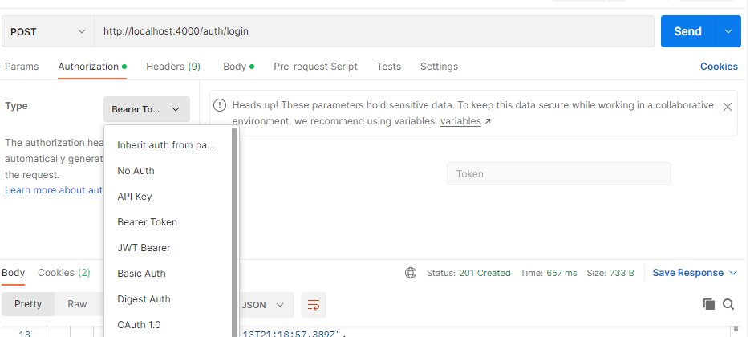

## Handling User Registration MySQL

Now we need to create our route and services, controller for users's registration.

Always make use of a format that makes a lot of sense
- From route to controller
- From controller to service
- From service to model.

Always follow this format because it allows separation of commands and allows reuse of services. 

### Services
They are your just regular collection of functions. We can have an authentication services. 

### Authentication using auth.services.js
We can decide different functions or have a class that contains static functions, you can choose whatever you want. For this class, we want to create a class that contains static fuctions.

<b><i>src/services/auth.service.js</i></b>

To start with, we need to import the user model

From <b><i>src/model/user.model.js</i></b>

    export class User extends Model {
        async comparePassword(plain) {
            return await bcrypt.compare(plain, this.password);
        }
        ................
    }

Adding the `export` keyword before the `Model` class allows us to export the `User` Model too. 

Now  we need to import the `User` Model inside the services

    import { User } from "../models/user.model.js";

We then create our static functions for the Authentication Service. Remember to make them async functions

    export class AuthService {
        static async register(data) {}
        static async login(data) {}
    }

We can are going to send request then it goes to the route then from the route it goes to controller from controller to services, the services uses the model.

We still need some set of utilisation helpers better called <b>utilities.</b> We need them to properly manage our application.

### Building Utilities and Middleware for Error Handling
We want to create a setup that consider global error handlings. All we have to do is to throw errors, and the error handler wil handle it. So instead of using the if statements: as if this is not true, throw error inside functions.

They are called abstraction, helpers or ultilities. 
So we are going to bulid <b>utilities</b> and use <b>middlewares</b> for error handling. We are also going to use JWT and Async handler.

<b><i>src/utils/ApiError.js</i></b>

So what we are doing here is that we want to extend error. <b>Error</b> is a class in JavaScript. So that pickup error and throw error and dispay it through our error middleware.

The Error class has a constructor `Error()`, so when we get an error in javascript the error class is intialised. We can use try and catch to imitate such error and catch error rather than let it to explode in our application and crash our application. 

It has message, options, filename and other stuffs. So for our Api Error, we can take variables like statusCode, message, errors for our `constructor`

    export class ApiError extends Error{
        constructor(statusCode, message, errors){
            super(message)
            this.statusCode = statusCode;
            this.errors = errors;
        }
    }

We are going to `super()` the message to handle error message. We may choose to display or log the message

    static badRequest(message, errors) {
        return new ApiError(404, message, errors);
    }

    static unauthorised(message, errors) {
        return new ApiError(401, message, errors);
    }

What `static` does is that they are function allows us to create new instances within the classes. So with that we can handle instances of error related to badRequests, unauthorised, forbidden, notFound, internalError, with their respective status codes and messages

Now to work on the utils for the `jwt`

<b><i>src/utils/jwt.js</i></b>

We are going to need to bring in secrets from our <b>config/env.js</b> file i.e `JWT_SECRET`, `JWT_EXPIRES_IN`, 

    import jwt from "jsonwebtoken";
    import { configuration } from "../config/env";

<b>jsonwebtoken</b>

It is a means to create secure identity of different things. Things could be different users, different computer whatever the case maybe. It gives a long code of random characters. It like an encryption but made harder, just like salt in bcrypt to tighten the hashes. Encryption is like a padlock, where we need to provide key. To create an encryption a key is added. To decrypt that jwt we need to pass that key again and see the payload.

Payload to be encrypted includes user_id, user_role, use_remail. We are also encrypt the expiration time, such that if anyone tempers with our token, the signature will change and we wil not verify ther person. 

    export const signedToken = (payload) => 
        jwt.sign(payload, configuration.JWT_SECRET, 
        {expiresIn: configuration.JWT_EXPIRES_IN}
    );

This functions perfroms encryption to make signed token and assign the time for the JWT to expire

    export const verifyToken = (payload) => jwt.verify(token, configuration.JWT_SECRET);

This helps to verify the token or in case of tempering and this makes use of `configuration.JWT_SECRET` to verify

We are still going to need another <b>utils</b> for that will handle all our response. This is to pick errors and give a standard for all our errors. 

    const sendSucess = (res, data, message, code) => 
    res.status(code).json({sucess: true, message, data});

Just so that we can have things centralised in one place. - Relationship which will be do later.

So we want to import all our models in one place - <b>model/src/index.js</b>

    import {User} from "./user.model.js";

    export {User};

So we will also have to setup a neutral ground for our services. t.e where we will import all our services but later.

This thing about this is tht the index.js allows us to make us import User model from model directly without specifying filename and filepath. It only uses the folder

    import {User} from "../models"

### Registration - Checking If a user exists before registering

Whenever we are checking if something is in database or getting something from database, these are called queries. This is Model Query  we use Sequelize methods like `Model.find()`, `Model.findOne()`, `Model.findAll()`, `Model.findPk()`.

So we want to use `Model.findOne()` just to check that finds the first entries of a query like email or what ever unique thing we are doing. So all things we can do it in controllers.

`auth.controllers.js`

There are also other ways to get email like uuid

But for the capstone, don't kill yourself for now just use id for now.

So we have added `UUID` for public. Note for any big project do not release id because of enumeraion which is being able to guess the next person. So with uuid it is random, so we can't get the id. So since this is a small just use id.

`uuid` examples

    public_id: {type: DataTypes.UUIDV4},

<b><i>src/controllers/auth.controller.js</i></b>

We import our utils and services into our controller. Controller is where the main business logic happens.

We also need an Async Handler, because we are dealing with async functions incase if something as failed before Node.js rejects it.

<b><i>src/utils/asyncHandler.js</i></b>

    export const asyncHandler = (fn) => (req, res, next) => 
    Promise.resolve(req, res, next).catch(next);

This takes in an <b>async function</b> as an argument

This is to ensure that all our asynchoronous function resolves successfully breaks gracefully before they enter the enter app.

`.next()` is there beacuse we want to have a global error handler.

Back to auth.controller.js, we import our async handler

    import { asyncHandler } from "../utils/asyncHandler.js";

Now we want to create an async function that registers user, but normally we would use 

    export const register = async(req, res) => {

    };

Since we have an async handler incase if anything breaks we can then do 

    export const register = asyncHandler(async(req, res) => {

    });

The async handler takes the async functions as the argument.

    export const register = asyncHandler(async(req, res) => {
        const user = await AuthService.register(req.body);
        sendSucess(res, {id: user.public_id, email: user.email}, 'Registered Successfully', 200);
    });

We first send the from the controller to the service. The service authenticate registration by checking if user exists or not. This service makes use of the models. It either throws error or not via await. If not it sends a Sucess Message.

Also in our `sendSucess()` we can set default values for the message and status code parameters.

Now let's deal with our auth.services for registration, and logging in.

    static async register(data) {
        if (await User.findOne({where: {email: data.email}})) {
            throw ApiError.badRequest("Email already exists", 400);
        }
    }

If you user's email already exists, throw a bad request API error. We can also set the default status code in the static function as 400

After Sucessful registration i.e no bad request, we need to verify token using `crypto` which is already built in with node

    import crypto from "node:crypto";

We use crypto to verify token

    const verifyToken = crypto.randomBytes(12).toString('hex');

We also set the default role as 'user' (because we have 'user' and 'admin)

    const role = data.role || 'user'; 

After that we add the model to database

    const user = await User.create(...data, verifyToken, roles)
    return user;

User Registration handled

The `User.create()` uses an object method to add properties like `verifyToken` to data. `User.create(...data, role)` counters that part where we used delete.verifyToken. Beacause according to sense, we don't delete verifyToken when registration, only change it during password recovery

#### Setting Public ID i.e UUID - Uniform Unique Identifier. Recommended for big projects to serve as id instead of using the actual id in the database

Back to `src/user.model.js`

    public_id: {type: DataTypes.UUIDV4, defaultValue: DataTypes.UUIDV4},

`defaultValue: DataTypes.UUIDV4` allows us to set the default data type value to UUIDV4

#### Role Model

We also want to make a Role model via role.model.js but to save time, we are doing it in MySQL Workbench

But lets still do the Role Model in role.model.js you check the role.model.js file.

    type: DataTypes.STRING(50)

Sets the maximum character length, we can also check the documentations for others

### Connecting Controllers to Route

So we want to connect `auth.controller.js` to `auth.route.js` So that we can work with `/register` and `/login`

Remember controller is for business logic, it makes use of services and utilities.

<b><i>src/route/auth.route.js</i></b>

We will use express Router

    import express from "express";
    const route = express.Router();

#### Handling `register` in the auth.controller.js

    import { register } from "../controllers/auth.controller";

We use express router to connect the route to the controller

    route.post("/register", register);

    export default route;

<b>App.js </b>

Since it is a default, we can give it a name in the import

    import Authenticate from "./routes/auth.route.js"

We then use the route

    app.use("/auth", Authenticate);

We still have to handle global error in applications. and all we need to do is use that global error in our catch in try-catchs

### Middleware for handling global errors

<b><i>src/middleware/errorHandling.js</i></b>

We need to also work the ApiError Handler in the <b>utils</b>

    export const globalErrorHandler = (err, req, res, next) => {
        if (err instanceof ApiError) return res.status(err.statusCode).json({sucess: false, mesage: err.message, error: err.errors});
}

We are saying if the error is an instance of the API error class, that if the error is an instance of Error, we need to send a res response of the sucess, message and error

We may likely encounter Sequelize errors too

    if (err.name === "SequelizeValidator") {
        return res.status(err.statusCode)
        .json({sucess: false, mesage: "Duplicate entry", error: err.errors});
    }

We also have validation errors, jwt error too to handle but later. 

We have tested the code and was able to add user to database with public id and encrypted password

Now are going it to use our middleware <b>app.js</b>

### Logging In

For logging in, we are going to need email and password as arguments

<b><i>src/services/auth.service.js</i></b>

    static async login(email, password) {}

So we want to check if users exists and if he exist compare the password in database to the one entered

    const user = await User.findOne({where: {email: data.email}});
    if (user || !await user.comparePassword(password)) throw ApiError.badRequest("Invalid credentials");

    await user.update({lastLogin: new Date()});

Now we want to handle authorisation for the user to access routes, so we generate access token.

    const accessToken = signedToken(payload)
    console.log("Access Token:" + accessToken);
    return {user, accessToken};

After that we send a suceess response 

Back to auth.controller.js

    export const login = asyncHandler(async(req, res) => {
        const loginProcess = await AuthService.login(req.body);
        sendSuccess(res, 
            {user: loginProcess.user, token: loginProcess.accessToken}, 
            "Logged in sucessfully", 
            201
        );
    });

So to make use of our controller

    import { login, register } from "../controllers/auth.controller.js";

    router.post("/login", login);

### Roles for Admin and Authorisation for accessing routes

In this case, we need to create an endpoint that helps us to fetch user info, two middleware one for roles, one for after they have logged in.

So what we want to do is middleware to protect some endpoints.

<b><i>src/middleware/auth.js</i></b>

We are going to need the verification token

    import { verifyToken } from "../utils/jwt.js";

We need to protect end points so that only people that are <b>logged in</b> can access the endpoints.

We will also create a controller for a route `/profile` that requires you to be logged in.

We will pass the token through the headers i.e frontend will pass it through headers.  

    export const authenticate = async(req, res, next) => {}

We can't use async handler because this is a middleware, it must run finish. If you do, we will not be able to capture errors form the middleware properly. 

We are saying that even after we have exceed what where middleware as been used, we still except a response for anything that is pending.

Whenever a frontend send a token it comes with a prefix `bearer` + space + token. `bearer` is a common protocol used for handling authorisation, we also have others like jest and the rest.

So what we are using is JWT Bearer

    export const authenticate = async(req, res, next) => {
        try{
            const header = req.header.authorisation || undefined;
            if (!header || !header.startsWith('Bearer')) throw ApiError.unauthorised();

        } catch (error) {

        }
    }

First we verify if the header contains a form of authorisation. If the header contains an authorisation, we check if it carries the `Bearer` prefix for any JWT. it not, user is not authorised

    const token = header.split(" ")[1];
    
After that we capture only the token part of the JWT using `.split()` string method.

    const decoded = verifyToken(token);

Find also need to verify user by id just incase

    const user = await User.findByPk(decoded.id);

If user doesn't exist by id we throw an unauthorised error

    if (!user) throw ApiError.unauthorised();

As a middleware, we pass information from the route to the controller.

    req.user = user 
    next()

We updated `req.user` as the actual user so that we will not need to verify by id again since it passes the auth middleware. `next()` to move to next middleware or proceed to route.

If get an error, we can use `next(error)` to throw an error.

We can set authorisation for admin

#### Setting Endpoints for only admin through authorisation

    export const authoriseAdmin = (req, res, next) => {
    try{
        if (!req.user) throw ApiError.unauthorised();
        if (req.user.role !== "admin") throw ApiError.unauthorised();
    } catch (error) {
        next(error);
    }
`}

<!-- 
### Relationship between models using index.js

<b><i>src/model/index.js</i></b> -->

  

